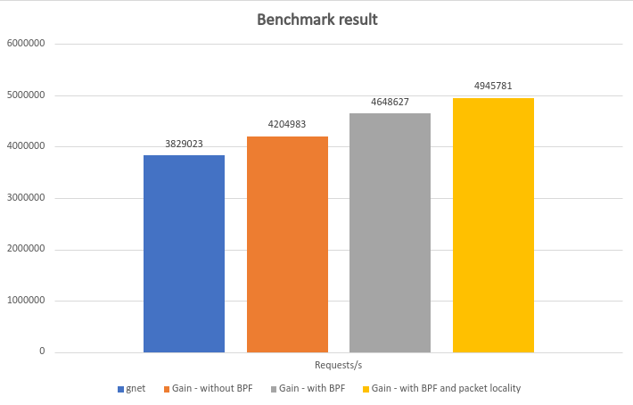

<a name="readme-top"></a>

<br />
<div align="center">
  <a href="https://github.com/pawelgaczynski/gain">
    
  </a>

  [![Apache 2.0 License][license-shield]][license-url]
  [](https://pkg.go.dev/github.com/pawelgaczynski/gain)
  [](https://goreportcard.com/report/github.com/pawelgaczynski/gain)
  [](https://codecov.io/gh/pawelgaczynski/gain)

  <h2 align="center">Gain</h2>

  <p align="center">
    Gain is a high-performance io_uring networking framework written entirely in Go.
    <br />
    <br />
    <a href="https://github.com/pawelgaczynski/gain/issues">Report Bug</a>
    ·
    <a href="https://github.com/pawelgaczynski/gain/issues">Request Feature</a>
  </p>
</div>


<details>
  <summary>Table of Contents</summary>
  <ol>
    <li>
      <a href="#about-the-project">About The Project</a>
    </li>
    <li>
      <a href="#getting-started">Getting Started</a>
      <ul>
        <li><a href="#prerequisites">Prerequisites</a></li>
        <li><a href="#installation">Installation</a></li>
      </ul>
    </li>
    <li><a href="#usage">Usage</a></li>
    <li><a href="#roadmap">Roadmap</a></li>
    <li><a href="#performance">Performance</a></li>
    <li><a href="#contributing">Contributing</a></li>
    <li><a href="#license">License</a></li>
    <li><a href="#contact">Contact</a></li>
    <li><a href="#relevant-articles">Relevant Articles</a></li>
  </ol>
</details>

<br/>

## About The Project

Gain is a high-performance networking framework written entirely in Go. It uses io_uring - a new asynchronous I/O API for Linux created by Jens Axboe from Facebook. Currently only Linux is supported.

**WARNING: This is an alpha version so it is not yet stable enough to use in a production environment.**

Articles about the project:

* [Medium - Meet Gain - the New Fastest Go TCP Framework](https://medium.com/better-programming/gain-the-new-fastest-go-tcp-framework-40ec111d40e6)
* [Medium - Writing High-performance TCP Applications Using the Gain Web Framework](https://medium.com/better-programming/an-introduction-to-gain-part-1-writing-high-performance-tcp-application-df5f7253e54a)

<br/>

## Getting Started


**See examples:**

* **[CLI server example](https://github.com/pawelgaczynski/gain/blob/main/examples/cli/main.go)**
* **[TCP echo server example](https://github.com/pawelgaczynski/gain/blob/main/examples/tcp_echo/main.go)**

<br/>

### Prerequisites

Gain requires Go 1.19+

<br/>

### Installation

1. Install the framework
   ```sh
   go get -u github.com/pawelgaczynski/gain@v0.3.1-alpha
   ```

<p align="right">(<a href="#readme-top">back to top</a>)</p>

## Roadmap

- [x] Go liburing port
- [x] Reactor architecture
- [x] Socket sharding architecture
- [x] Async workers and workers pool
- [x] Lock-free
- [ ] Protocols
    - [x] TCP
    - [x] UDP
    - [ ] Unix Domain Socket
- [ ] Load balancing
    - [x] Round robin
    - [x] Least connection
    - [x] Source IP hash
    - [ ] Support for custom implementations
- [ ] Support for read and write deadlines
- [ ] Further io_uring optimizations
- [x] More flexible connection buffer
- [x] Documentation
- [x] Support for kernels older than 5.15
- [ ] Support for Windows - IoRing ([documentation](https://learn.microsoft.com/en-us/windows/win32/api/ioringapi/))

See the [open issues](https://github.com/pawelgaczynski/gain/issues) for a full list of proposed features (and known issues).

<p align="right">(<a href="#readme-top">back to top</a>)</p>


## Performance

AWS EC2 instance: m6i.xlarge
<br/>
vCPU: 4
<br/>
RAM: 16GB
<br/>
OS: Ubuntu 22.04 LTS
<br/>
Kernel: 5.15.0-1026-aws
<br/>
Go: go1.19.3 linux/amd64
<br/>
Number of connections: 512
<br/>
Benchmark type: [see TechEmpower Plaintext](https://github.com/TechEmpower/FrameworkBenchmarks/wiki/Project-Information-Framework-Tests-Overview#plaintext)
<br/>

<br/>
<a href="https://github.com/pawelgaczynski/gain">
  
</a>
<br/>
<br/>

### Perfect locality

Run this script on the server machine before starting Gain. The first parameter is the name of network interface (e.g. eth0, ens5).

```sh
#!/bin/bash

systemctl stop irqbalance.service

export IRQS=($(grep $1 /proc/interrupts | awk '{print $1}' | tr -d :))
for i in ${!IRQS[@]}; do echo $i > /proc/irq/${IRQS[i]}/smp_affinity_list; done;

export TXQUEUES=($(ls -1qdv /sys/class/net/$1/queues/tx-*))
for i in ${!TXQUEUES[@]}; do printf '%x' $((2**i)) > ${TXQUEUES[i]}/xps_cpus; done;

```

To understand how it was achieved read an excellent article: [Extreme HTTP Performance Tuning](https://talawah.io/blog/extreme-http-performance-tuning-one-point-two-million/#_5-perfect-locality)

<p align="right">(<a href="#readme-top">back to top</a>)</p>

## Contributing

Contributions are what make the open source community such an amazing place to learn, inspire, and create. Any contributions you make are **greatly appreciated**.

If you have a suggestion that would make this better, please fork the repo and create a pull request. You can also simply open an issue with the tag "enhancement".
Don't forget to give the project a star! Thanks again!

1. Fork the Project
2. Create your Feature Branch (`git checkout -b feature/AmazingFeature`)
3. Commit your Changes (`git commit -m 'Add some AmazingFeature'`)
4. Push to the Branch (`git push origin feature/AmazingFeature`)
5. Open a Pull Request

<p align="right">(<a href="#readme-top">back to top</a>)</p>

## License

Distributed under the Apache 2.0 License. See `LICENSE` for more information.

<p align="right">(<a href="#readme-top">back to top</a>)</p>


## Contact

Paweł Gaczyński - [LinkedIn](http://linkedin.com/in/pawel-gaczynski)

Project Link: [https://github.com/pawelgaczynski/gain](https://github.com/pawelgaczynski/gain)

<p align="right">(<a href="#readme-top">back to top</a>)</p>


## Relevant Articles

* [Lord of the io_uring](https://unixism.net/loti/what_is_io_uring.html)
* [Ringing in a new asynchronous I/O API](https://lwn.net/Articles/776703/)
* [The rapid growth of io_uring](https://lwn.net/Articles/810414/)
* [An Introduction to the io_uring Asynchronous I/O Framework](https://blogs.oracle.com/linux/post/an-introduction-to-the-io-uring-asynchronous-io-framework)
* [How io_uring and eBPF Will Revolutionize Programming in Linux](https://www.scylladb.com/2020/05/05/how-io_uring-and-ebpf-will-revolutionize-programming-in-linux/)
* [Missing Manuals - io_uring worker pool](https://blog.cloudflare.com/missing-manuals-io_uring-worker-pool/)
* [IO_uring Continues Advancing In 2022 With New Features For Pushing Linux I/O](https://www.phoronix.com/news/KR2022-IO_uring)
* [Getting Hands on with io_uring using Go](https://developers.mattermost.com/blog/hands-on-iouring-go/)
* [liburing Github](https://github.com/axboe/liburing)

<p align="right">(<a href="#readme-top">back to top</a>)</p>


[license-shield]: https://img.shields.io/badge/License-Apache_2.0-blue.svg
[license-url]: https://github.com/pawelgaczynski/gain/blob/main/LICENSE
